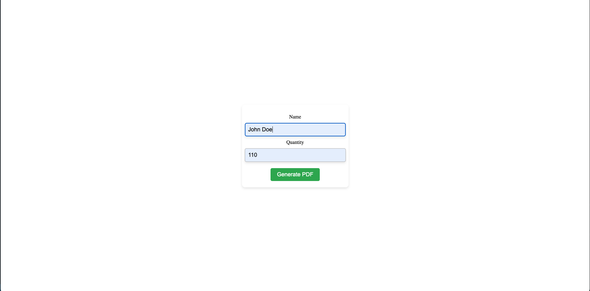
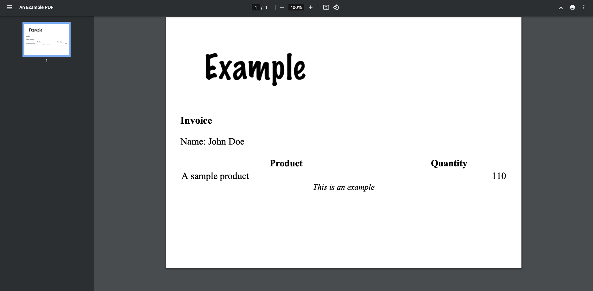

# PDF Generator with Dompdf

This project is a simple PHP application that generates a PDF file based on user input using the [Dompdf](https://github.com/dompdf/dompdf) library. The PDF output includes dynamic content populated from a form submission, such as the user's name and quantity input.

## Features

- **Dynamic PDF generation:** User input is passed from an HTML form, and the values are injected into a template for PDF generation.
- **Security enhancements:** User input is sanitized using `htmlspecialchars` to prevent injection attacks.
- **Landscape paper orientation:** The generated PDF is in A4 size and landscape orientation.
- **Template-based rendering:** An external HTML template (`template.html`) is used for flexible content generation.

### Example Form



### Generated PDF



## CSS:

- [Water.css](https://watercss.kognise.dev/)
- [Gutenberg CSS](https://github.com/BafS/Gutenberg)

## Requirements

- PHP 7.4 or higher
- Composer for managing dependencies

- ## Acknowledgements

## Example Code

```php
<?php 

// This is magic constant
require __DIR__ . "/vendor/autoload.php";

use Dompdf\Dompdf;
use Dompdf\Options;

$name = htmlspecialchars($_POST["name"]);
$quantity = htmlspecialchars($_POST["quantity"]);

$options = new Options;
$options->setChroot(__DIR__);

$dompdf = new Dompdf($options);

$dompdf->setPaper("A4", "Landscape");

$html = file_get_contents("template.html");

$html = str_replace(["{{ name }}", "{{ quantity }}"], [$name, $quantity], $html);

$dompdf->loadHtml($html);
$dompdf->render();

$dompdf->addInfo("Title", "An Example PDF");

$dompdf->stream("example.pdf", ["Attachment" => 0]);


